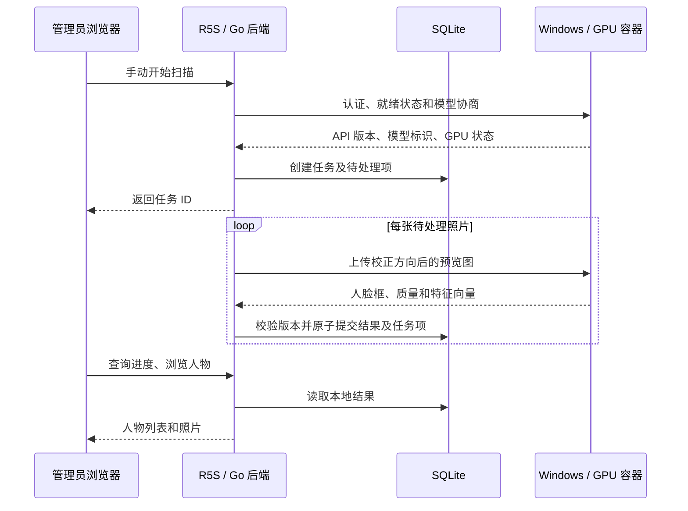

# 本地人脸识别开发设计

## 1. 状态与目标

日期：2026-09-27。状态：第一版已在本仓库实现；本文仍保留最初的设计边界。实际部署步骤与当前限制以 [部署说明](../../operations/face-recognition.md) 为准。Windows GPU 容器尚需目标电脑实测。

已确认的使用环境与交互：

- NanoPi R5S，4GB 内存：继续运行 77Photo，管理原图、SQLite、人物相册和扫描进度。
- Windows 主力电脑，RTX 3060 Ti、32GB 内存：按需启动 GPU Docker 识别服务。
- 管理员手动触发扫描；电脑无需常开，扫描结束后可以关闭。
- 图片和人脸特征只在自有设备之间处理，不调用第三方云端识别 API。

实现目标：检测照片中的人脸，提取特征，将同一个人的照片归类；支持命名、合并和纠正错误归类。断线、关闭浏览器、重启任一设备均不得丢失已提交的结果。

本文对尚未讨论的产品细节给出第一版建议。模型权重、依赖精确版本和性能阈值必须在开发阶段完成授权核查与实机验证，不能把本文当作已发布镜像的安装说明。

## 2. 第一版范围

包含：

- 管理员连接测试、手动增量扫描、失败重试、暂停、继续和取消。
- 管理员人物列表、人物照片列表、命名、合并、将误归类的人脸移入另一人物或新人物、忽略人脸。
- JPEG、PNG、HEIC/HEIF 和动态照片的静态主图。
- 中文、英文界面；移动浏览器适配。
- 已识别内容离线浏览，电脑不在线时仍可命名、纠正和查看人物。

暂不包含：视频逐帧识别、动态照片的视频部分、刷脸登录、活体检测、陌生人身份查询、自动定时扫描、Android 原生界面、公开人物分享、跨模型无损迁移。

第一版人物界面与接口仅限管理员。普通成员继续使用现有照片功能；未来开放成员人物浏览前，需专门设计人物名称、封面、数量和关联关系的权限，不能只过滤照片列表就视为完成权限隔离。普通照片响应和公开分享响应不附加人物信息。

## 3. 系统结构



职责边界：

| 组件 | 职责 | 持久化 |
| --- | --- | --- |
| R5S Go 服务 | 鉴权、选片、预览准备、任务调度、相似度匹配、人工纠正、API | SQLite、已有照片及缓存目录 |
| Windows GPU 服务 | 图片解码、检测、对齐、特征提取 | 仅模型和运行配置，不保存上传图片、人物库或任务 |
| Web | 管理员操作、轮询进度、人物浏览 | 不保存密钥或人脸向量 |

连接方向固定为 R5S 主动请求电脑。电脑不挂载 R5S 原图库、不直连 SQLite，也不需要 77Photo 管理员凭据。关闭电脑只影响新识别。

## 4. 与现有项目衔接

| 当前代码 | 复用或扩展方式 |
| --- | --- |
| `internal/photos/service.go` | 读取照片、内容校验和、源版本及方向；接入删除和移动后的校验 |
| `internal/thumbnails/service.go` | 复用已有 1280px 预览生成能力与方向处理，不复制另一套 HEIC 解码逻辑 |
| `internal/media/` | 缺失预览时复用媒体工具；限制解码并发和超时 |
| `internal/database/database.go`、`migrations/` | 新增顺序迁移；沿用 SQLite WAL、单连接池 |
| `internal/maintenance/lock.go` | 增加 `face_scan` 维护类型，与重扫、重建、导入、清理、用户迁移互斥 |
| `internal/httpapi/server.go`、`cmd/77photo/main.go` | 注入服务、注册接口、处理生命周期与重启恢复 |
| `internal/config/config.go` | 新增识别服务配置及校验 |
| `web/src/features/settings/SettingsWorkspace.tsx` | 增加连接状态和扫描任务卡片 |
| `web/src/app/api.ts` | 新增任务和人物 API 类型 |
| `docs/api/openapi.yaml` | 实现时补齐正式 API 契约 |

新增 `internal/faces/`，内部划分客户端、任务、预处理、匹配、人物操作和 HTTP 处理。Windows 服务建议置于 `services/face-worker/`，独立 Dockerfile、依赖锁文件、模型清单及测试。

现有缩略图重建任务主要保存在进程内存，不能直接照搬为可恢复队列。新任务项必须写入 SQLite。网络请求和图片解码期间不得持有数据库事务或未关闭的查询游标，避免单连接池阻塞全站。

`source_revision` 在照片改名和移动时也会改变，不等于图片内容版本。识别去重使用 `checksum` 和处理管线标识；`source_revision` 用于预览缓存和在途结果的新鲜度检查。

## 5. Windows 服务与模型

### 5.1 运行技术

实现采用 Python + FastAPI + ONNX Runtime GPU，单进程加载一份模型，初始推理并发为 1。不用多进程 Web worker 重复占用显存。GPU 服务的构建目标为 `linux/amd64`；R5S 主应用继续使用 `linux/arm64`，不安装 CUDA 或 Python 推理依赖。

第一版实际选用 OpenCV Zoo YuNet（MIT）检测和 SFace（Apache-2.0）特征提取，固定版本与 SHA-256 由 `services/face-worker/prepare_models.py` 提供。仍需在 RTX 3060 Ti 上完成速度与模型效果验收。

第一阶段输出 `models/manifest.json`，记录：

- 模型来源、许可证文本或链接、允许的使用及分发范围。
- 检测和特征权重 SHA-256、输入尺寸、RGB/BGR、归一化参数、对齐方式、输出维度。
- Python、ONNX Runtime、CUDA、cuDNN 的实测兼容版本。
- `embedding_model_id`、`pipeline_id` 和支持的 `api_version`。

`embedding_model_id` 包含权重和特征前处理版本，维度相同也不代表兼容。`pipeline_id` 额外包含检测器、输入预览规格、方向处理、质量过滤等会改变结果的配置。匹配阈值使用独立 `matching_policy_version`。

镜像固定发布版本及 digest，不使用 `latest`。就绪检查要求 CUDA provider 实际可用且模型预热成功；不得静默退回 CPU 后仍报告 GPU 就绪。部分前后处理在 CPU 上执行属于正常现象。

### 5.2 Windows 部署约定

需要支持 WSL2 的 Windows、较新的 NVIDIA Windows 驱动，以及启用 WSL2 后端的 Docker Desktop（Linux 容器模式）。Windows 版本尚未确认，实施前检查；GPU 透传失败时先解决环境问题。

Windows 上通常无需另装完整 CUDA Toolkit，也不要在 WSL 内另装 Linux 显卡驱动。镜像包含所需运行库，Windows 驱动必须满足其最低要求。

实施时交付 `services/face-worker/compose.yaml`、`.env.example`、依赖锁文件、PowerShell 部署说明与精确版本兼容表。下面仅表示目标结构，镜像尚未发布，不能直接运行：

```yaml
services:
  face-worker:
    image: ${FACE_WORKER_IMAGE:?set a verified version or digest}
    platform: linux/amd64
    ports:
      - "${FACE_BIND_IP:?set the Windows LAN IP}:8091:8091"
    environment:
      FACE_API_KEY: ${FACE_API_KEY:?set a random secret}
      FACE_REQUIRE_GPU: "true"
      FACE_MAX_CONCURRENCY: "1"
      FACE_MODEL_DIR: /models
    volumes:
      - ./models:/models:ro
    read_only: true
    tmpfs:
      - /tmp:size=256m
    restart: "no"
    deploy:
      resources:
        reservations:
          devices:
            - driver: nvidia
              count: 1
              capabilities: [gpu]
```

镜像应以非 root 用户运行，将必须的临时缓存放入 `/tmp`；启动时校验模型哈希，不自动联网下载权重。模型预先安装，推理过程不依赖公网。

完成实现后，日常操作为 `docker compose up -d`，连接测试成功后在 77Photo 点击扫描；结束后 `docker compose stop`。电脑休眠视为服务离线，任务按第 8 节暂停。

固定电脑局域网 IP 或 DHCP 租约。R5S 中使用电脑的局域网地址，不使用 `localhost`、WSL 临时 IP 或 `host.docker.internal`。Windows 防火墙只允许 R5S 来源访问 8091，不配置路由器公网端口转发。

## 6. 输入与推理 API

### 6.1 预览与坐标

第一版使用校正 EXIF 方向后、最长边 1280px 的预览图，优先复用现有缓存；这是一项减少 R5S 解码成本的取舍，小脸和大合影可能漏检。先测效果，必要时再引入 2048px 管线，不能声称 1280px 与原图效果相同。

预览重新编码为不含 EXIF/GPS 的 JPEG。缺失缓存时通过有界队列生成，一次仅一张；不得将原始 HEIC 或视频自动转发电脑作为回退。记录实际宽高和管线版本，不因空结果自动反复发送原图。

返回坐标以方向校正后的完整预览为基准：左上原点，`bbox=[x,y,width,height]`，归一化到 `[0,1]`，框不能越界。头像裁剪使用相同方向和比例；所有 EXIF 方向 1–8 均需验证。

### 6.2 服务接口

所有接口要求 `Authorization: Bearer <secret>`，不接受任意 URL、文件路径或回调地址。

| 方法与路径 | 契约 |
| --- | --- |
| `GET /v1/health` | 模型预热完成才返回 200；包含 API、管线、特征模型、维度和运行设备；未就绪返回 503 |
| `POST /v1/analyze` | `multipart/form-data`：一张 `image`、`request_id`、期望的 `pipeline_id`；同步返回该照片全部人脸 |

响应结构示例（数值仅作字段说明，不是精度或阈值承诺）：

```json
{
  "request_id": "fi_example",
  "api_version": "1",
  "pipeline_id": "pipeline-example-v1",
  "embedding_model_id": "embedding-example-v1",
  "embedding_dim": 512,
  "image": {"width": 1280, "height": 853},
  "faces": [
    {
      "index": 0,
      "bbox": [0.2, 0.1, 0.15, 0.24],
      "detection_score": 0.99,
      "quality": {"usable": true, "reasons": []},
      "embedding_encoding": "float32-le-base64",
      "embedding": "<base64 of 512 little-endian float32 values>"
    }
  ]
}
```

特征经 L2 归一化，第一版只接收固定管线的固定维度。Go 校验 base64 长度、有限数值、范数容差、边界框、输入尺寸、模型和管线标识。低质量人脸可返回空特征及质量原因，只进入人工查看，不参与自动归类。无人脸用 `faces: []` 返回 200，也是成功结果。

初始限额：请求体 8MiB、解码像素 12MP、单图最多 100 张脸、响应 1MiB；最终以实测调整。超出人脸数限制返回明确错误，不静默截断。错误使用稳定 code：401 未认证、409 管线不匹配、413 输入超限、422 图片损坏、429 忙、503 GPU/模型不可用。

客户端初始连接超时 5 秒、单图总超时 60 秒，均可配置。不把已接收请求数量当完成进度；只有 R5S 提交结果后才算成功。

## 7. R5S 配置与管理 API

建议新增环境变量（均未实现）：

| 变量 | 默认值 | 含义 |
| --- | --- | --- |
| `PHOTO_FACE_ENABLED` | `false` | 是否启用人物功能 |
| `PHOTO_FACE_WORKER_URL` | 空 | 电脑服务地址 |
| `PHOTO_FACE_WORKER_TOKEN` | 空 | 服务密钥，只存在后端配置 |
| `PHOTO_FACE_REQUEST_TIMEOUT` | `60s` | 单图请求总超时 |
| `PHOTO_FACE_ALLOW_INSECURE_LAN` | `false` | 显式允许可信局域网 HTTP |

第一版沿用部署配置习惯，地址和密钥通过环境变量配置，设置页只展示脱敏状态、连接测试与操作按钮；不新增网页密钥编辑器。修改后重启 Go 服务。连接离线不影响主站 `/healthz`。

HTTPS 为默认建议；可信家庭局域网可显式启用 HTTP，但传输中的图片、特征和令牌没有加密。跨网络使用 Tailscale/WireGuard 等私有加密通道。严格校验证书；固定服务 origin、不跟随重定向、限制响应大小，接口不能被普通用户用作任意网络代理。

拟新增管理员 API：

| 方法与路径 | 用途 |
| --- | --- |
| `GET /api/v1/admin/faces/config` | 脱敏配置、功能开关、已登记模型；不返回密钥 |
| `POST /api/v1/admin/faces/test` | 检查连接、认证、GPU、协议与模型兼容性 |
| `POST /api/v1/admin/faces/jobs` | 创建任务：`mode=incremental/retry_failed`，可选 `folder_id` |
| `GET /api/v1/admin/faces/jobs` | 当前和历史任务，分页 |
| `GET /api/v1/admin/faces/jobs/{id}` | 状态、计数、失败摘要 |
| `POST /api/v1/admin/faces/jobs/{id}/pause` | 停止调度，取消或等待在途请求后暂停 |
| `POST /api/v1/admin/faces/jobs/{id}/resume` | 重新检查模型、资源和照片状态，继续原任务 |
| `POST /api/v1/admin/faces/jobs/{id}/cancel` | 结束剩余项，保留已完成识别 |
| `GET /api/v1/admin/people` | 人物列表；可按照片 owner 筛选 |
| `GET /api/v1/admin/people/{id}/photos` | 人物照片，按 photo ID 去重并分页 |
| `PATCH /api/v1/admin/people/{id}` | 命名、设置封面 |
| `POST /api/v1/admin/people/{id}/merge` | 将指定人物合入目标人物 |
| `PATCH /api/v1/admin/faces/{id}` | 指派现有人物、新建人物、忽略或取消忽略 |
| `GET /api/v1/admin/faces/{id}/thumbnail` | 验证权限和照片状态后返回裁剪头像 |

沿用现有 session、CSRF、错误响应和 request ID 规则，拒绝非管理员请求。变更人物操作带修订版本，旧页面并发修改返回 409。`POST jobs` 使用幂等键，重复点击返回原任务；已有未终结任务时返回其 ID，不能创建重复队列。

## 8. 持久化任务与恢复

初始只允许一个未终结扫描任务、一个在途推理请求。当前实现以单条 `INSERT ... SELECT` 固定候选集合；大图库分批物化仍待性能实测后优化。候选为 `deleted_at IS NULL AND scan_status='indexed'` 的静态图片，排除视频、配对资源与损坏/缺失文件。

任务创建后按主键游标分批物化候选项，不把全库照片载入内存；任务进入 running 前固定候选集合和总数。选片阶段持久化游标，高水位限定候选范围；扫描期间新上传的照片下次处理。

```text
queued -> preparing -> running -> completed / completed_with_errors
                         |
                         +-> pausing -> paused
                         +-> paused_offline
                         +-> failed
paused / paused_offline -> queued（管理员继续）
任何未终结状态 -> cancelled
重启遗留的 preparing / running / pausing -> paused（原因 server_restart）
```

- preparing/running 持有 `maintenance.KindFaceScan`，启动或继续时若被其他维护任务占用，返回 409，不抢占。
- paused、paused_offline 和所有终态释放维护锁；暂停的任务仍占“唯一未终结任务”名额，需继续或取消。
- 锁不能覆盖普通上传、删除、改名等全部行为，所以每张发送前及提交前仍需检查照片有效性、owner、checksum 和 source revision。
- 单次请求遇到断线、超时、429 或可恢复 5xx，最多自动重试 3 次，使用带抖动退避并尊重有界 Retry-After；连续服务不可用进入 paused_offline，不把全库标成失败。恢复在线后仍由管理员点击继续。
- 401、模型不匹配和协议错误停止任务并显示明确原因；图片损坏等单项错误记为 failed 后继续其他图片。
- 网络推理允许重复，但写入必须幂等。任务项成功、分析结果、人脸和自动关联在一个短事务中提交。客户端超时或崩溃后重试不能产生重复人脸。
- 暂停、取消增加执行代次，旧代次的迟到响应不得写入。重启将遗留 in-flight 项恢复 pending，已提交项保持成功。
- 提交前发现照片删除则丢弃结果；内容变化标记 stale，下一次增量扫描重新选片；仅改名/移动时仍保守丢弃在途响应并重新校验，不使用旧路径。已完成结果在内容相同且 owner 未变时可复用。
- 计数由任务项状态推导：`total = pending + in_flight + succeeded + failed + skipped + cancelled`；无人脸属于 succeeded，另统计 `no_face` 和 `faces_found`。

关闭浏览器不暂停任务。UI 每两秒轮询，网络请求失败只表示页面暂时拿不到进度，不改变服务端状态。

## 9. 数据设计

新增顺序迁移，编号使用实施时下一个可用编号，不重写已有迁移。以下为逻辑字段，正式 SQL 需补充外键、状态 CHECK 和索引。

| 表 | 核心字段与约束 |
| --- | --- |
| `face_model_profiles` | 管线 ID、特征模型 ID、维度、预处理与阈值策略、模型清单；活动管线唯一 |
| `face_scan_jobs` | ID、创建管理员、模式、范围、状态、选片游标、模型快照、执行代次、时间和错误摘要 |
| `face_scan_items` | job ID、photo ID、owner/校验和快照、状态、尝试次数、错误；唯一 `(job_id, photo_id)` |
| `face_analyses` | ID、photo ID、checksum、pipeline ID、输入宽高、完成人脸数；唯一 `(photo_id, checksum, pipeline_id)`，包含无人脸记录 |
| `faces` | ID、analysis ID、序号、框、分数、质量、特征 BLOB、当前人物、自动/人工来源、ignored、修订版本；唯一 `(analysis_id, index)` |
| `people` | ID、namespace owner ID、名称、封面 face ID、修订版本、合并目标、时间 |
| `face_person_exclusions` | face ID、person ID、创建时间；唯一二元组，记录人工排除 |

特征 BLOB 使用小端 float32；当前 SFace 是 128 维、每张约 512 字节，10 万张人脸的纯特征约 49MiB，不含表、索引、WAL、头像和备份。SQLite 是特征的权威存储，缓存只能重建，不能作为唯一副本。

人物归类按 `photos.owner_id` 建立命名空间，第一版不跨 owner 自动匹配或合并，管理员可切换 owner 浏览。同一个人在不同 owner 下可以有不同人物记录。用户照片迁移后，旧关联和人工名称不直接带入新 owner：事务内解除旧关联，保留有效特征，在新 owner 范围重新归类；不得泄露原命名空间名称。

头像缓存键包含 face ID、内容校验和和裁剪版本。封面必须来自未删除、有效且属于该人物的照片；失效后选取有效替代。原照片硬删除时级联删除分析、特征、排除关系和缓存，软删除立即从人物查询、匹配代表样本和头像接口排除；不能只依赖缓存过期。

## 10. 人物归类与人工纠正

只比较同一 owner、同一 `embedding_model_id` 的可用特征，使用余弦相似度；分数不是概率。

第一版采取保守增量归类：每个人物保留有上限的高质量代表样本，优先人工确认样本；用最相近候选和次近候选的差值共同判断。只有超过经验证的匹配阈值且不存在明显歧义才自动关联，否则创建未命名人物，后续人工合并。阈值不照抄其他模型的 0.7/0.8 等示例值。

不做全库所有人脸两两比较，不因 A 相似 B、B 相似 C 就自动合并 A/C。默认同一照片中不同检测框不自动分配给同一人物，镜子、海报或拼图情形允许人工纠正。低清、侧脸、儿童成长和相似亲属是重点验证样本。

纠正规则：

- 命名、手动指派和忽略是人工决定，后续增量扫描不能覆盖。
- 移出某人物时记录排除关系，避免再次被自动归回；忽略的人脸不参与自动匹配。
- 合并只允许同命名空间，事务内迁移关联和排除关系，保留目标 ID，旧 ID 指向合并目标；不能形成循环。合并界面说明目标名称及数量，修订冲突返回 409。
- 同一管线已成功的照片不重复分析，避免 face ID 漂移。失败项重试不得清空其他成功结果。
- 内容变化使旧分析失效，不以旧序号将人工标签强行绑定新框。

第一版不开放任意换模型或全库“重算”按钮。服务报告不同模型/管线时阻止扫描，保留旧人物可读。后续升级需单独的重建流程：并存新旧分析，以同照片框重叠等证据生成迁移建议，人工确认有歧义的标签，再切换活动版本；不能直接混合向量或清空人工命名。

代表样本分批读取或做有界缓存。大量未命名人物仍可能拖慢 R5S，需实测匹配耗时；超过预算后再评估近似搜索或将匹配计算交给电脑，不在第一版增加常驻向量数据库。

## 11. 页面与数据保护

管理员设置页显示：功能是否配置、服务在线/离线、GPU 就绪、当前任务进度、失败原因和开始/暂停/继续/取消操作。首次使用说明“照片预览将发送到你的电脑，识别结果保存在照片服务器”。不在普通相册浏览流程展示 CUDA 等实现细节。

新增管理员「人物」入口，显示头像、名称和照片数；未命名人物可直接命名。人物详情复用已有图库和查看器，照片详情允许逐脸纠正。电脑离线时只禁用需要推理的操作。

GPU 服务不得记录图片、向量、Authorization、人物名或完整文件路径，不启用请求体调试；只记录随机请求 ID、耗时和错误码。不接受图片 URL，避免自行拉取外部资源。实现时确认 multipart 库不会将图片写入持久盘，溢出的临时文件只能位于内存临时目录，并限制请求体及并发。

“应用不主动落盘”不等于宿主机内存永不进入页面文件、WSL swap 或崩溃转储；部署说明应如实描述这一边界，不宣称绝对零残留。可按个人需要启用 Windows 磁盘加密。

R5S 上的人脸特征同样属于敏感数据，不通过普通照片 API 下发，也不写入日志。SQLite 及备份应受与原图库相同的访问保护。停用功能保留可浏览结果；如提供“清除人物数据”，需明确清除范围、停止任务并清除数据库与头像缓存，不删除原图。历史备份中的副本按备份保留策略处理。

## 12. 开发顺序与交付物

### 阶段 A：实机可行性验证

- 核对 Windows/WSL2/Docker GPU 透传，验证 CUDA provider 实际推理。
- 核查候选模型权重授权，生成模型清单和固定依赖版本。
- 选取约 100 张经允许用于测试的照片，包含多人、侧脸、儿童、旋转图片和 HEIC。
- 测量识别效果、GPU 显存、电脑内存、R5S 解码成本、网络流量及端到端耗时。
- 决定 1280px 输入是否满足需求、质量阈值和匹配策略。不将私人测试照片提交仓库。

交付：实测记录、权重许可清单、最小 GPU 服务、经过验证的 Windows 安装步骤。

### 阶段 B：协议与持久化扫描

- 实现服务健康检查和 analyze 契约、认证、限额、模型校验。
- 新增迁移、Go 客户端、任务调度与重启恢复、维护锁集成。
- 完成预览处理、幂等落库、增量选择、断线暂停和失败重试。
- 更新 OpenAPI；Web 提供连接测试与扫描进度。

交付：管理员可完成一次扫描并在断线、重启后继续，结果不重复。

### 阶段 C：人物相册与纠正

- 实现 owner 命名空间、匹配、人物分页、封面与照片查询。
- 命名、合并、移出/指派、忽略、排除规则与并发修订检查。
- 覆盖删除、移动、用户迁移、权限和公开分享隔离。
- 完成中英文及移动浏览器交互。

交付：电脑关闭后仍能完整浏览、命名并纠正人物相册。

### 阶段 D：发布与部署

- 发布独立 `linux/amd64` GPU 镜像，固定版本/digest；原 R5S 镜像不包含模型运行库。
- 交付 Windows Compose、模型安装与校验说明、故障排查和版本兼容表。
- 更新 README、部署、备份、API 与验收文档，补充产品设计决策记录。
- 完成迁移前备份和恢复演练；数据库变更后的回滚依赖兼容版本或备份恢复，不能只回退容器标签。

## 13. 测试与验收

自动化测试优先覆盖行为边界：

1. 401/403、CSRF、公开分享和普通成员无法获得人物元数据或向量。
2. 缓存和预览方向、归一化坐标及裁剪一致；无人脸成功落库并在增量扫描时跳过。
3. 同一请求重复提交、超时后重试、提交前后崩溃均不重复计数或生成人脸。
4. 断线、429、模型改变、密钥错误分别进入正确状态；暂停/取消后的迟到响应被拒绝。
5. 扫描期间删除、改名、内容变化、共享调整和 owner 迁移不写入错误关联。
6. 人工指派、排除和合并结果在重试、重启及增量扫描后保留；不同 owner 和不同模型不互相匹配。
7. 响应含 NaN/Inf、错误维度、超限输入、损坏图片等被拒绝；GPU 不可用时不假报就绪。
8. 全新数据库和已有数据库迁移成功，照片硬删除级联正确，封面与缓存不泄露失效内容。
9. 关闭浏览器后任务继续；刷新页面恢复真实进度，离线电脑不影响人物浏览和主站健康。

性能实测分两组：100 张功能样本和至少 1,000 张持续扫描样本。分别记录冷启动/热推理、p50/p95 单图耗时、GPU 利用率/显存、R5S 内存峰值/CPU、预览生成耗时和扫描时图库接口延迟。比较扫描开关前后的正常浏览体验；出现内存持续增长、长时间锁库或路由服务受影响时，降低并发并修复后才发布。不在未实测前承诺照片/秒。

实现阶段运行项目现有 Go 测试与 vet、Web 测试/typecheck/build，以及 worker 的协议和 GPU 实机测试。GPU 测试单列，普通 CI 可以通过假 worker 验证调度和故障恢复，但不能把 CPU 测试当成 GPU 兼容证明。

最终验收场景：启动电脑容器 → 连接测试 → 手动扫描 → 中途停止容器 → R5S 保留进度 → 重启容器并手动继续 → 完成归类和命名 → 关闭电脑 → 人物相册可浏览 → 新上传照片后再次扫描只处理增量。

## 14. 实施时参考资料

精确依赖与平台要求以实施时官方文档为准：

- [Docker Desktop GPU 支持](https://docs.docker.com/desktop/features/gpu/)
- [NVIDIA CUDA on WSL](https://docs.nvidia.com/cuda/wsl-user-guide/index.html)
- [Docker Compose GPU 配置](https://docs.docker.com/compose/how-tos/gpu-support/)
- [ONNX Runtime CUDA 兼容要求](https://onnxruntime.ai/docs/execution-providers/CUDA-ExecutionProvider.html)
- [InsightFace 项目与授权说明](https://github.com/deepinsight/insightface)

仍需在阶段 A 确认：Windows 版本、R5S 系统和其他负载、图库规模、模型及权重许可、输入尺寸效果、驱动/CUDA/cuDNN/ONNX Runtime 的精确组合。上述事项不影响先按本文拆分代码与任务，但会影响最终镜像发布和性能结论。
