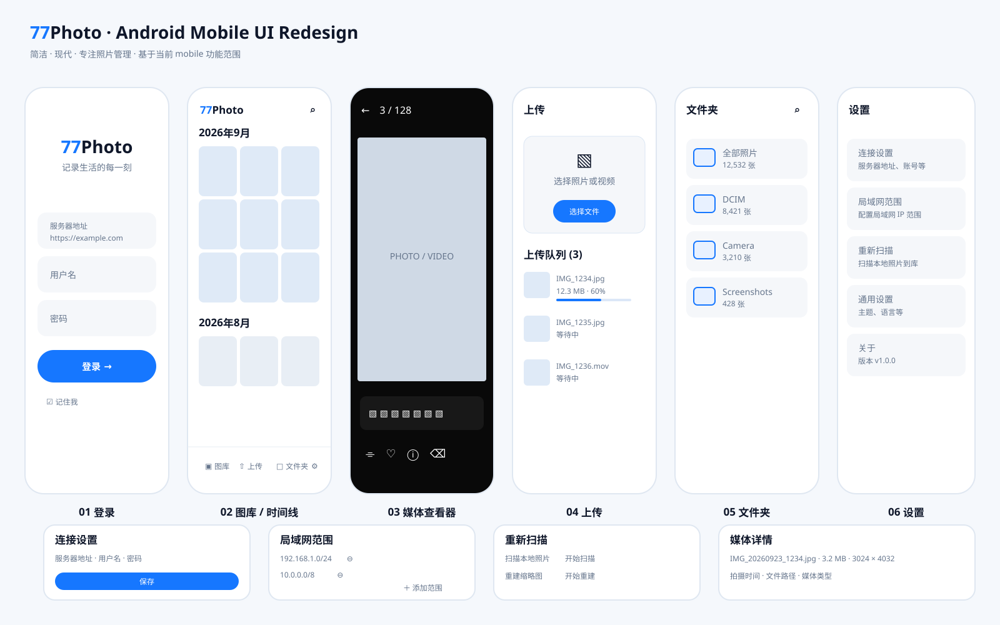

# 77Photo Mobile UI Redesign

> Status: design proposal only. This document does not change application behavior.

## Design overview

The overview above is the visual baseline for the current redesign proposal. It covers the actual mobile product scope: Login, Gallery / Timeline, Media Viewer, Upload, Folder Browser, Settings, Connection Settings, LAN Ranges, Rescan, and Media Details.

## 1. Goal

Refresh the existing React Native mobile UI without expanding the product scope. The design must remain consistent with 77Photo as a lightweight, self-hosted family photo library: quiet, simple, photo-first, and practical.

The proposal is based on the screens currently present under `mobile/src/features`.

## 2. Existing mobile information architecture

### Primary screens
- Login — `features/auth/LoginScreen.tsx`
- Gallery / timeline — `features/gallery/GalleryScreen.tsx`
- Media viewer — `features/viewer/MediaViewerScreen.tsx`
- Upload — `features/upload/UploadScreen.tsx`
- Folder browser — `features/folders/FolderBrowserScreen.tsx`
- Folder picker — `features/folders/FolderPickerScreen.tsx`
- Settings — `features/settings/SettingsScreen.tsx`

### Secondary surfaces
- Connection settings — `features/auth/ConnectionSettingsScreen.tsx`
- LAN ranges — `features/settings/LanRangesScreen.tsx`
- Media details bottom sheet — `features/viewer/MediaDetailsSheet.tsx`
- Rescan panel — `features/settings/RescanPanel.tsx`

No social feed, discovery, messages, public profile, or social publishing pages are proposed.

## 3. Visual direction

### Principles
1. Photo first — UI should disappear behind the user's library.
2. Low visual noise — avoid gradients, decorative illustrations, large marketing blocks, and unnecessary cards.
3. Consistent geometry — 14–18 px radii for fields/cards; compact spacing; generous outer whitespace.
4. One accent — use 77Photo blue for primary actions, active navigation, progress, and selection.
5. Native feeling — respect Android safe areas, back behavior, touch targets, and system typography.
6. Functional states remain visible — upload progress, errors, loading, Live Photo state, selection, and destructive actions must not be hidden for aesthetics.

### Suggested tokens
- Primary: #1677FF
- Primary pressed: #0B63E5
- Background: #F8FAFC / white
- Surface: #FFFFFF
- Input surface: #F5F7FA
- Primary text: #0F172A
- Secondary text: #64748B
- Divider: #E8EDF3
- Danger: #EF4444
- Corner radius: 16 px controls, 12 px thumbnails
- Horizontal page padding: 20–24 px
- Minimum touch target: 44–48 px

## 4. Login screen — approved direction

This is the first screen to implement.

### Layout
- Plain near-white background.
- Centered 77Photo wordmark in the upper-middle area.
- Subtitle: “记录生活的每一刻”.
- No hero photograph, wave illustration, handwritten slogan, marketing copy, or secondary help link.
- Three stacked fields:
  1. Server address
  2. Username
  3. Password
- Server address includes a link/server icon and an example URL as supporting text.
- Password includes visibility toggle.
- Full-width blue Login button with optional arrow affordance.
- “Remember me” directly below the primary button.
- Preserve current validation, connection behavior, credential-storage behavior, loading state, and errors.

### Interaction states
- Default: muted gray input surfaces.
- Focus: subtle blue border/ring; do not shift layout.
- Invalid: concise inline error below the affected field.
- Login pending: disable fields/button and show progress inside button.
- Server/network failure: show actionable error without clearing entered values.
- Password remains masked by default.

### Why this direction
The login page is configuration-heavy by necessity because 77Photo is self-hosted. Keeping server URL, username, and password together makes setup understandable while the reduced decoration prevents the screen from feeling like a setup wizard.

## 5. Gallery / timeline

- Keep gallery as the default post-login destination.
- Header: compact 77Photo title, search/action icons only where functionality already exists.
- Group photos by the current timeline/date model.
- Use a dense 3-column grid where screen width permits.
- 2–4 px grid gaps; rounded thumbnails should be subtle.
- Live Photo/video indicators appear as small overlays rather than large labels.
- Loading placeholders should preserve image aspect/position to avoid flashing.
- Bottom navigation: Gallery / Upload / Folders / Settings.

## 6. Media viewer

- Use a true dark/black viewing surface.
- Image/video gets maximum available space.
- Top controls: back, position/count where available, overflow.
- Bottom actions should map only to existing behavior.
- Media metadata opens in `MediaDetailsSheet` as a rounded bottom sheet.
- Live Photo state should be visually distinct from ordinary video without making the asset look like a standalone video card.

## 7. Upload

- Primary action is selecting photos/files.
- Keep upload queue immediately visible after selection.
- Each queue row: thumbnail, filename, size/status, progress, pause/retry state where supported.
- Avoid oversized empty-state artwork.
- Upload progress must remain readable during long background uploads.

## 8. Folders

- Simple native-style list with folder icon, name, item count if available, and chevron.
- Folder picker reuses the same visual language rather than introducing a separate design.
- Search/action controls only if backed by existing behavior.

## 9. Settings

Group existing settings into clear sections rather than a long collection of unrelated cards:
- Connection
- LAN/network access
- Library maintenance / rescan
- General
- About/version

Destructive or maintenance actions should be visually separated from routine settings.

## 10. Connection settings and LAN ranges

Connection settings should use the same field components as Login so users immediately recognize server/account configuration.

LAN ranges should favor a compact list:
- CIDR value
- enabled/disabled state where applicable
- remove action
- “Add range” as the single primary secondary action

Validation feedback should appear next to the edited CIDR value.

## 11. Media details sheet

Use a bottom sheet over the viewer with:
- filename
- captured date/time
- file size
- resolution / media type when available
- source/path when available

Metadata is informational; it should not compete visually with the photo.

## 12. Component plan

Before screen-by-screen implementation, consolidate shared UI in `src/components`:
- ScreenContainer
- AppHeader
- AppTextField
- PrimaryButton
- SettingsRow
- EmptyState
- ProgressRow
- BottomTabBar styling/tokens

Extend `components/theme.ts` into the single source for spacing, radii, typography, surface colors, and interaction colors.

## 13. Implementation order

1. Theme tokens and shared controls
2. Login
3. Bottom navigation + Gallery
4. Media viewer + details sheet
5. Upload
6. Folder browser / picker
7. Settings + connection + LAN ranges
8. Accessibility/state polish and screenshot review

## 14. Non-goals

This design proposal does not add:
- social/community features
- discovery/feed
- messaging
- profiles/followers
- cloud subscription UI
- new server APIs

The redesign should initially be achievable primarily in the React Native client while preserving the current API and product behavior.
